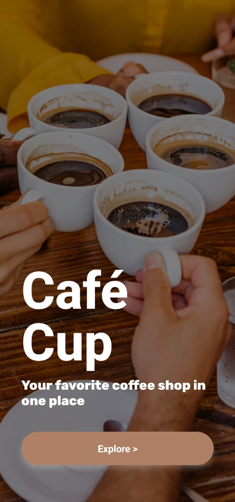
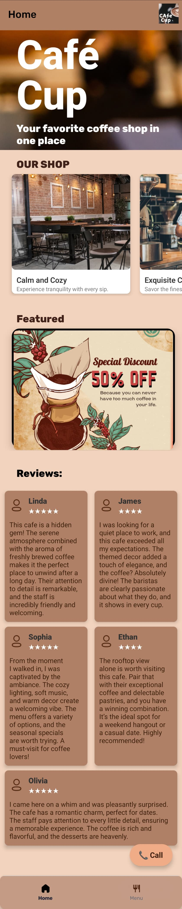
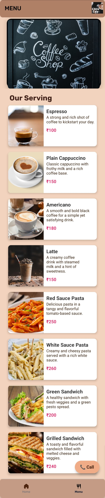

# Cafe App

Welcome to the **Cafe App**, a simple React Native application designed to showcase a coffee shop's menu and provide a delightful user interface. This app features a splash screen, a start page, and two primary tabs: **Menu** and **Home**.

## Features

- **Splash Screen**: Displays an attractive splash screen when the app launches.
- **Start Page**: Serves as the entry point to the app, welcoming users.
- **Tabs Navigation**:
  - **Home Tab**: A cozy landing page to explore the app.
  - **Menu Tab**: Showcases the café’s menu with all available offerings.

## Tech Stack

- **React Native**: For building the mobile application.
- **JavaScript**: For scripting and logic implementation.
- **React Navigation**: For handling navigation between screens.
- **Expo**: For ease of development, testing, and deployment.

## Installation

To run this app locally, follow these steps:

1. Clone the repository:
   ```bash
   git clone https://github.com/Harsh-git98/cafe_app.git
   ```

2. Navigate to the project directory:
   ```bash
   cd cafe_app
   ```

3. Install dependencies:
   ```bash
   npm install
   ```

4. Start the development server:
   ```bash
   npx expo start
   ```


## Screenshots

<div style="display: flex; flex-start: space-between;">







</div>

## Folder Structure

```plaintext
cafe-app/
├── assets/           # Images and fonts
├── components/       # Reusable components
├── app/root/tabs     # Individual screens
├── package.json      # Dependency configuration
└── README.md         # Project documentation
```

## Contributing

Contributions are welcome! If you'd like to contribute:

1. Fork the repository.
2. Create a new branch for your feature/bug fix.
3. Commit your changes and push them to your fork.
4. Open a pull request explaining your changes.


---

Feel free to reach out for suggestions or improvements! Enjoy exploring the **Cafe App**. ☕

